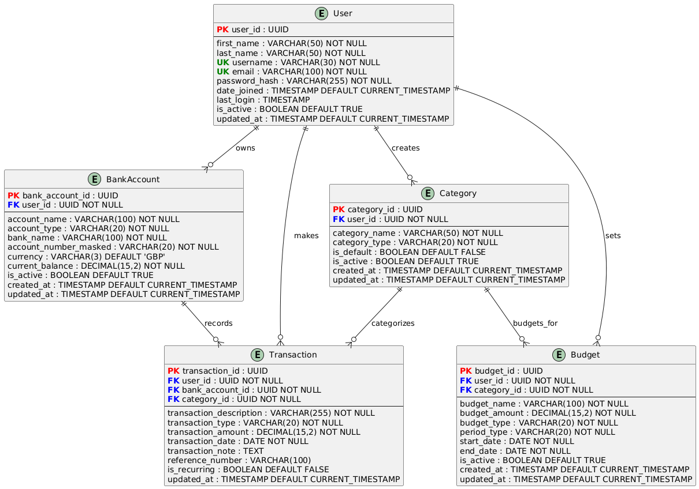

# BudgetBox API

A production-ready Personal Finance Management REST API built with Django REST Framework. This API provides comprehensive financial tracking capabilities including multi-account management, transaction tracking, budget monitoring, and intelligent spending analytics.

**Live Demo**: [https://budgetbox-api-ckwq.onrender.com](https://budgetbox-api-ckwq.onrender.com)

**Frontend Application**: [https://budgetbox-frontend.vercel.app](https://budgetbox-frontend.vercel.app)

**Frontend Repository**: [https://github.com/Vincent-Ngobeh/budgetbox-frontend](https://github.com/Vincent-Ngobeh/budgetbox-frontend)

---

## Table of Contents

- [Features](#features)
- [Tech Stack](#tech-stack)
- [Architecture](#architecture)
- [API Documentation](#api-documentation)
- [Database Schema](#database-schema)
- [Getting Started](#getting-started)
- [Environment Variables](#environment-variables)
- [Running Tests](#running-tests)
- [Deployment](#deployment)
- [API Reference](#api-reference)
- [Security](#security)
- [Performance](#performance)
- [Contributing](#contributing)
- [License](#license)
- [Author](#author)

---

## Features

### Core Functionality

- **Multi-Account Management**: Support for Current, Savings, and Credit Card accounts with multi-currency support (GBP, USD, EUR)
- **Transaction Tracking**: Complete income/expense tracking with categorization, search, and filtering
- **Budget Management**: Create, monitor, and track spending budgets with real-time progress
- **Category Organization**: Custom income and expense categories with default templates
- **Financial Analytics**: Detailed statistics, spending insights, and monthly summaries

### Advanced Features

- **Account Transfers**: Secure money transfers between accounts with automatic balance updates
- **Budget Recommendations**: Smart suggestions based on spending patterns and historical data
- **Bulk Operations**: Bulk categorization of transactions for efficient management
- **Transaction Duplication**: Quick duplication of recurring transactions
- **Budget Cloning**: Clone budgets for next period or custom date ranges
- **Account Statements**: Detailed statements with running balance calculations
- **Spending Pace Analysis**: Track if you're ahead or behind your budget targets
- **Savings Opportunities**: AI-powered identification of potential savings

### User Management

- **Token Authentication**: Secure token-based API authentication
- **User Profiles**: Complete profile management with financial summaries
- **Password Management**: Secure password change with token rotation
- **Default Categories**: Automatic creation of default categories on registration

---

## Tech Stack

| Category           | Technology                        |
| ------------------ | --------------------------------- |
| **Framework**      | Django 5.2.5                      |
| **API**            | Django REST Framework 3.16.1      |
| **Database**       | PostgreSQL                        |
| **Authentication** | Token Authentication              |
| **Documentation**  | drf-spectacular (OpenAPI 3.0)     |
| **Testing**        | Pytest, pytest-django, pytest-cov |
| **Test Data**      | Factory Boy, Faker                |
| **CORS**           | django-cors-headers               |
| **Static Files**   | WhiteNoise                        |
| **WSGI Server**    | Gunicorn                          |
| **Deployment**     | Render                            |

### Dependencies

```
Django==5.2.5
djangorestframework==3.16.1
drf-spectacular==0.28.0
django-cors-headers==4.7.0
psycopg2-binary==2.9.10
python-decouple==3.8
gunicorn==23.0.0
whitenoise==6.8.2
dj-database-url==2.3.0
pytest==8.4.1
pytest-django==4.11.1
pytest-cov==6.2.1
factory_boy==3.3.3
Faker==37.5.3
```

---

## Architecture

```
budgetbox-api/
├── config/                    # Project configuration
│   ├── settings.py           # Django settings
│   ├── urls.py               # Root URL configuration
│   └── wsgi.py               # WSGI application
├── finance/                   # Main application
│   ├── models.py             # Database models
│   ├── serializers.py        # DRF serializers
│   ├── views/                # ViewSets and API views
│   │   ├── auth.py           # Authentication endpoints
│   │   ├── bank_accounts.py  # Account management
│   │   ├── transactions.py   # Transaction operations
│   │   ├── categories.py     # Category management
│   │   └── budgets.py        # Budget tracking
│   ├── tests/                # Test suite
│   │   ├── test_authentication.py
│   │   ├── test_accounts.py
│   │   ├── test_transactions.py
│   │   ├── test_categories.py
│   │   ├── test_budgets.py
│   │   ├── test_permissions.py
│   │   ├── test_business_logic.py
│   │   └── test_api_endpoints.py
│   └── urls.py               # App URL patterns
├── docs/                      # Documentation
│   └── database/             # ERD diagrams
├── conftest.py               # Pytest fixtures
├── pytest.ini                # Pytest configuration
├── requirements.txt          # Python dependencies
├── render.yaml               # Render deployment config
└── build.sh                  # Build script
```

---

## API Documentation

### Interactive Documentation

The API provides interactive documentation via Swagger UI and ReDoc:

| Documentation      | URL                                                                 |
| ------------------ | ------------------------------------------------------------------- |
| **Swagger UI**     | [/api/docs/](https://budgetbox-api-ckwq.onrender.com/api/docs/)     |
| **ReDoc**          | [/api/redoc/](https://budgetbox-api-ckwq.onrender.com/api/redoc/)   |
| **OpenAPI Schema** | [/api/schema/](https://budgetbox-api-ckwq.onrender.com/api/schema/) |
| **API Root**       | [/api/](https://budgetbox-api-ckwq.onrender.com/api/)               |

### Postman Collection

A complete Postman collection is available for testing:
[View Postman Collection](https://vincent-ngobeh-3663782.postman.co/workspace/Vincent-Ngobeh's-Workspace~952f4852-14ea-40b0-83fd-86c3984588b3/collection/48118241-9769c948-963a-40f1-abb1-b28ebe48aba1)

---

## Database Schema

### Entity Relationship Diagram



### Models

#### User (Django Built-in)

Standard Django User model for authentication.

#### Category

```python
Fields:
- category_id: UUID (Primary Key)
- user: ForeignKey -> User
- category_name: CharField (max 50)
- category_type: CharField ['income', 'expense']
- is_default: Boolean
- is_active: Boolean
- created_at: DateTime
- updated_at: DateTime

Constraints:
- unique_together: [user, category_name, category_type]
```

#### BankAccount

```python
Fields:
- bank_account_id: UUID (Primary Key)
- user: ForeignKey -> User
- account_name: CharField (max 100)
- account_type: CharField ['current', 'savings', 'credit']
- bank_name: CharField (max 100)
- account_number_masked: CharField (format: ****1234)
- currency: CharField ['GBP', 'USD', 'EUR']
- current_balance: Decimal (max 9,999,999.99, min -10,000.00)
- is_active: Boolean
- created_at: DateTime
- updated_at: DateTime
```

#### Transaction

```python
Fields:
- transaction_id: UUID (Primary Key)
- user: ForeignKey -> User
- bank_account: ForeignKey -> BankAccount
- category: ForeignKey -> Category (nullable)
- transaction_description: CharField (max 255)
- transaction_type: CharField ['income', 'expense', 'transfer']
- transaction_amount: Decimal (max 999,999.99)
- transaction_date: Date
- transaction_note: TextField (optional)
- reference_number: CharField (optional)
- is_recurring: Boolean
- created_at: DateTime
- updated_at: DateTime

Indexes:
- [user, transaction_date]
- [user, transaction_type]
- [bank_account, transaction_date]
```

#### Budget

```python
Fields:
- budget_id: UUID (Primary Key)
- user: ForeignKey -> User
- category: ForeignKey -> Category
- budget_name: CharField (max 100)
- budget_amount: Decimal
- period_type: CharField ['weekly', 'monthly', 'quarterly', 'yearly']
- start_date: Date
- end_date: Date
- is_active: Boolean
- created_at: DateTime
- updated_at: DateTime
```

---

## Getting Started

### Prerequisites

- Python 3.10+
- PostgreSQL 12+ (or SQLite for development)
- pip or pipenv

### Installation

#### 1. Clone the Repository

```bash
git clone https://github.com/Vincent-Ngobeh/budgetbox-api.git
cd budgetbox-api
```

#### 2. Create Virtual Environment

```bash
# Windows
python -m venv venv
venv\Scripts\activate

# Linux/macOS
python3 -m venv venv
source venv/bin/activate
```

#### 3. Install Dependencies

```bash
pip install -r requirements.txt
```

#### 4. Configure Environment Variables

Create a `.env` file in the project root:

```env
SECRET_KEY=your-secret-key-here
DEBUG=True
DB_NAME=budgetbox_db
DB_USER=your_db_user
DB_PASSWORD=your_db_password
DB_HOST=localhost
DB_PORT=5432
ALLOWED_HOSTS=localhost,127.0.0.1
CORS_ALLOWED_ORIGINS=http://localhost:3000,http://127.0.0.1:3000
```

#### 5. Set Up Database

```bash
# Create PostgreSQL database (if using PostgreSQL)
createdb budgetbox_db

# Run migrations
python manage.py migrate

# Create superuser (optional)
python manage.py createsuperuser
```

#### 6. Load Sample Data (Optional)

```bash
python manage.py seed_user_data --username testuser --password testpass123
```

#### 7. Run Development Server

```bash
python manage.py runserver
```

The API will be available at `http://localhost:8000/`

---

## Environment Variables

| Variable               | Description                              | Default                       |
| ---------------------- | ---------------------------------------- | ----------------------------- |
| `SECRET_KEY`           | Django secret key                        | Required                      |
| `DEBUG`                | Debug mode                               | `False`                       |
| `DATABASE_URL`         | Database connection URL (for production) | -                             |
| `DB_NAME`              | Database name                            | Required (if no DATABASE_URL) |
| `DB_USER`              | Database user                            | Required (if no DATABASE_URL) |
| `DB_PASSWORD`          | Database password                        | Required (if no DATABASE_URL) |
| `DB_HOST`              | Database host                            | `localhost`                   |
| `DB_PORT`              | Database port                            | `5432`                        |
| `ALLOWED_HOSTS`        | Comma-separated allowed hosts            | `localhost,127.0.0.1`         |
| `CORS_ALLOWED_ORIGINS` | Comma-separated CORS origins             | `http://localhost:3000`       |

---

## Running Tests

### Run All Tests

```bash
pytest
```

### Run with Coverage Report

```bash
pytest --cov=finance --cov-report=html
```

### Run Specific Test File

```bash
pytest finance/tests/test_transactions.py
```

### Run with Verbose Output

```bash
pytest -v
```

### Test Categories

| Test File                | Description                      |
| ------------------------ | -------------------------------- |
| `test_authentication.py` | User registration, login, logout |
| `test_accounts.py`       | Bank account CRUD and transfers  |
| `test_transactions.py`   | Transaction operations           |
| `test_categories.py`     | Category management              |
| `test_budgets.py`        | Budget tracking and actions      |
| `test_permissions.py`    | User data isolation              |
| `test_business_logic.py` | Business rules validation        |
| `test_api_endpoints.py`  | API accessibility                |

---

## Deployment

### Render Deployment

The API is configured for deployment on Render with the included `render.yaml`:

```yaml
databases:
  - name: budgetbox-db
    databaseName: budgetbox
    user: budgetbox_user
    plan: free

services:
  - type: web
    name: budgetbox-api
    runtime: python
    plan: free
    buildCommand: ./build.sh
    startCommand: gunicorn config.wsgi:application
```

### Manual Deployment Steps

1. Set environment variables on your hosting platform
2. Run migrations: `python manage.py migrate`
3. Collect static files: `python manage.py collectstatic --noinput`
4. Start with Gunicorn: `gunicorn config.wsgi:application`

---

## API Reference

### Authentication Endpoints

| Method  | Endpoint                     | Description                             | Auth |
| ------- | ---------------------------- | --------------------------------------- | ---- |
| `POST`  | `/api/auth/register/`        | Register new user                       | No   |
| `POST`  | `/api/auth/login/`           | Login and get token                     | No   |
| `POST`  | `/api/auth/logout/`          | Logout and delete token                 | Yes  |
| `GET`   | `/api/auth/profile/`         | Get user profile with financial summary | Yes  |
| `PATCH` | `/api/auth/profile/update/`  | Update user profile                     | Yes  |
| `POST`  | `/api/auth/change-password/` | Change password                         | Yes  |

### Bank Accounts Endpoints

| Method   | Endpoint                         | Description               |
| -------- | -------------------------------- | ------------------------- |
| `GET`    | `/api/accounts/`                 | List all accounts         |
| `POST`   | `/api/accounts/`                 | Create new account        |
| `GET`    | `/api/accounts/{id}/`            | Get account details       |
| `PUT`    | `/api/accounts/{id}/`            | Update account            |
| `PATCH`  | `/api/accounts/{id}/`            | Partial update account    |
| `DELETE` | `/api/accounts/{id}/`            | Delete account            |
| `GET`    | `/api/accounts/summary/`         | Get accounts summary      |
| `GET`    | `/api/accounts/{id}/statement/`  | Get account statement     |
| `POST`   | `/api/accounts/{id}/transfer/`   | Transfer between accounts |
| `POST`   | `/api/accounts/{id}/deactivate/` | Deactivate account        |

**Query Parameters:**

- `type`: Filter by account type (current, savings, credit)
- `is_active`: Filter by active status
- `currency`: Filter by currency (GBP, USD, EUR)
- `min_balance`: Filter by minimum balance

### Transactions Endpoints

| Method   | Endpoint                             | Description                  |
| -------- | ------------------------------------ | ---------------------------- |
| `GET`    | `/api/transactions/`                 | List transactions            |
| `POST`   | `/api/transactions/`                 | Create transaction           |
| `GET`    | `/api/transactions/{id}/`            | Get transaction details      |
| `PUT`    | `/api/transactions/{id}/`            | Update transaction           |
| `PATCH`  | `/api/transactions/{id}/`            | Partial update transaction   |
| `DELETE` | `/api/transactions/{id}/`            | Delete transaction           |
| `GET`    | `/api/transactions/statistics/`      | Get spending statistics      |
| `GET`    | `/api/transactions/monthly_summary/` | Get monthly summary          |
| `POST`   | `/api/transactions/bulk_categorize/` | Bulk categorize transactions |
| `POST`   | `/api/transactions/{id}/duplicate/`  | Duplicate transaction        |

**Query Parameters:**

- `bank_account`: Filter by account ID
- `category`: Filter by category ID
- `type`: Filter by type (income, expense, transfer)
- `date_from`: Start date (YYYY-MM-DD)
- `date_to`: End date (YYYY-MM-DD)
- `min_amount`: Minimum absolute amount
- `is_recurring`: Filter recurring transactions

### Categories Endpoints

| Method   | Endpoint                                      | Description               |
| -------- | --------------------------------------------- | ------------------------- |
| `GET`    | `/api/categories/`                            | List categories           |
| `POST`   | `/api/categories/`                            | Create category           |
| `GET`    | `/api/categories/{id}/`                       | Get category details      |
| `PUT`    | `/api/categories/{id}/`                       | Update category           |
| `PATCH`  | `/api/categories/{id}/`                       | Partial update category   |
| `DELETE` | `/api/categories/{id}/`                       | Delete category           |
| `GET`    | `/api/categories/{id}/usage/`                 | Get category usage stats  |
| `POST`   | `/api/categories/set_defaults/`               | Create default categories |
| `POST`   | `/api/categories/{id}/reassign_transactions/` | Reassign transactions     |

**Query Parameters:**

- `type`: Filter by type (income, expense)
- `is_active`: Filter by active status
- `has_transactions`: Filter by transaction presence

### Budgets Endpoints

| Method   | Endpoint                        | Description                |
| -------- | ------------------------------- | -------------------------- |
| `GET`    | `/api/budgets/`                 | List budgets               |
| `POST`   | `/api/budgets/`                 | Create budget              |
| `GET`    | `/api/budgets/{id}/`            | Get budget details         |
| `PUT`    | `/api/budgets/{id}/`            | Update budget              |
| `PATCH`  | `/api/budgets/{id}/`            | Partial update budget      |
| `DELETE` | `/api/budgets/{id}/`            | Delete budget              |
| `GET`    | `/api/budgets/{id}/progress/`   | Get budget progress        |
| `GET`    | `/api/budgets/overview/`        | Get budgets overview       |
| `GET`    | `/api/budgets/recommendations/` | Get budget recommendations |
| `POST`   | `/api/budgets/{id}/clone/`      | Clone budget               |
| `POST`   | `/api/budgets/{id}/deactivate/` | Deactivate budget          |
| `POST`   | `/api/budgets/{id}/reactivate/` | Reactivate budget          |
| `POST`   | `/api/budgets/bulk_create/`     | Bulk create from template  |

**Query Parameters:**

- `is_active`: Filter by active status
- `period_type`: Filter by period (weekly, monthly, quarterly, yearly)
- `category`: Filter by category ID
- `current`: Show only current period budgets
- `exceeded`: Show only exceeded budgets

---

## Security

### Authentication

- Token-based authentication using Django REST Framework's TokenAuthentication
- Tokens are invalidated on password change
- Secure password hashing with Django's built-in validators

### Data Protection

- Complete user data isolation - users can only access their own data
- Input validation on all endpoints with comprehensive serializer validation
- SQL injection protection via Django ORM
- CORS configuration for controlled frontend access

### Best Practices

- Environment-based configuration for sensitive data
- Debug mode disabled in production
- HTTPS enforcement on production deployment
- Masked account numbers (only last 4 digits stored)

---

## Performance

### Database Optimization

- Indexed fields for frequently queried columns
- `select_related()` and `prefetch_related()` for efficient joins
- Annotated querysets for computed fields

### Caching

- Statistics endpoint caching (5-minute TTL)
- Cache invalidation on data modifications

### Pagination

- Default pagination (20 items per page)
- Configurable page size

### Query Efficiency

- Optimized aggregation queries for statistics
- Bulk update operations for category reassignment

---

## Contributing

This is a portfolio project, but feedback and suggestions are welcome!

1. Fork the repository
2. Create your feature branch (`git checkout -b feature/AmazingFeature`)
3. Commit your changes (`git commit -m 'Add some AmazingFeature'`)
4. Push to the branch (`git push origin feature/AmazingFeature`)
5. Open a Pull Request

---

## License

This project is licensed under the MIT License - see the [LICENSE](LICENSE) file for details.

---

## Author

**Vincent Sam Ngobeh**

- GitHub: [@Vincent-Ngobeh](https://github.com/Vincent-Ngobeh)
- LinkedIn: [Vincent Ngobeh](https://www.linkedin.com/in/vincent-ngobeh/)
- Email: vincentngobeh@gmail.com

---

## Acknowledgments

- Django REST Framework for the excellent API framework
- drf-spectacular for OpenAPI documentation
- The Django community for comprehensive documentation
- Render for hosting services

---

**Note**: This is a portfolio project demonstrating proficiency in Django REST Framework, API design, database management, testing, and software engineering best practices.
